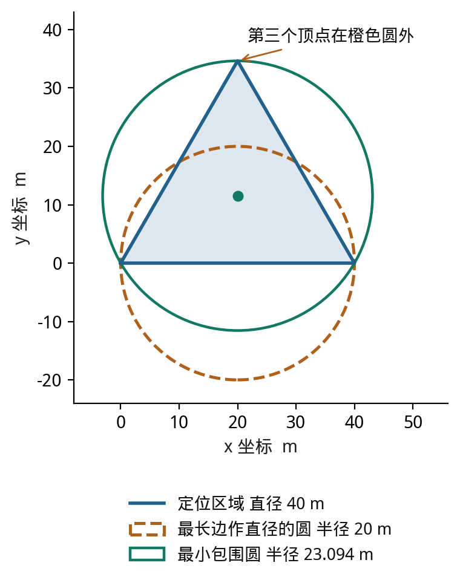
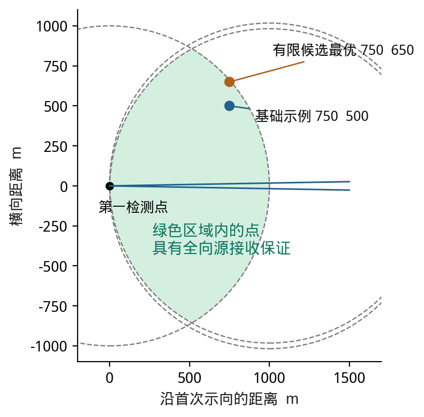
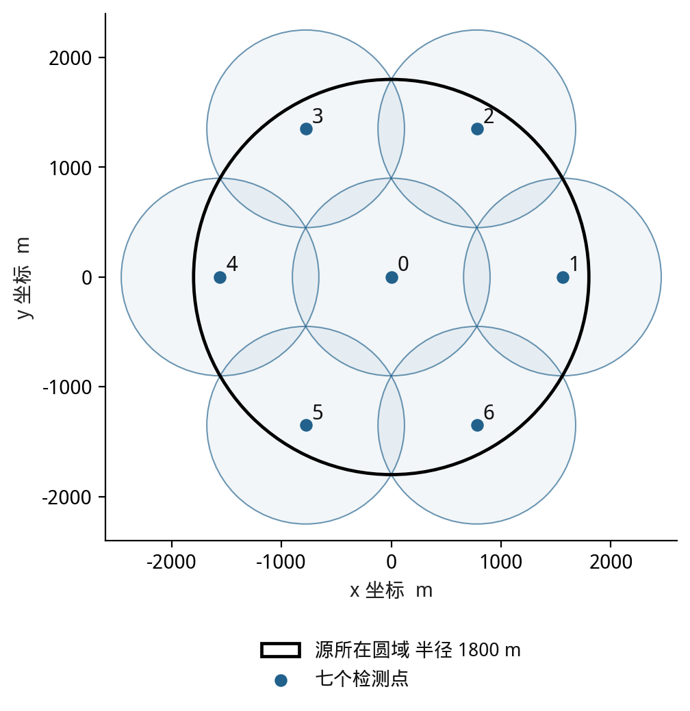
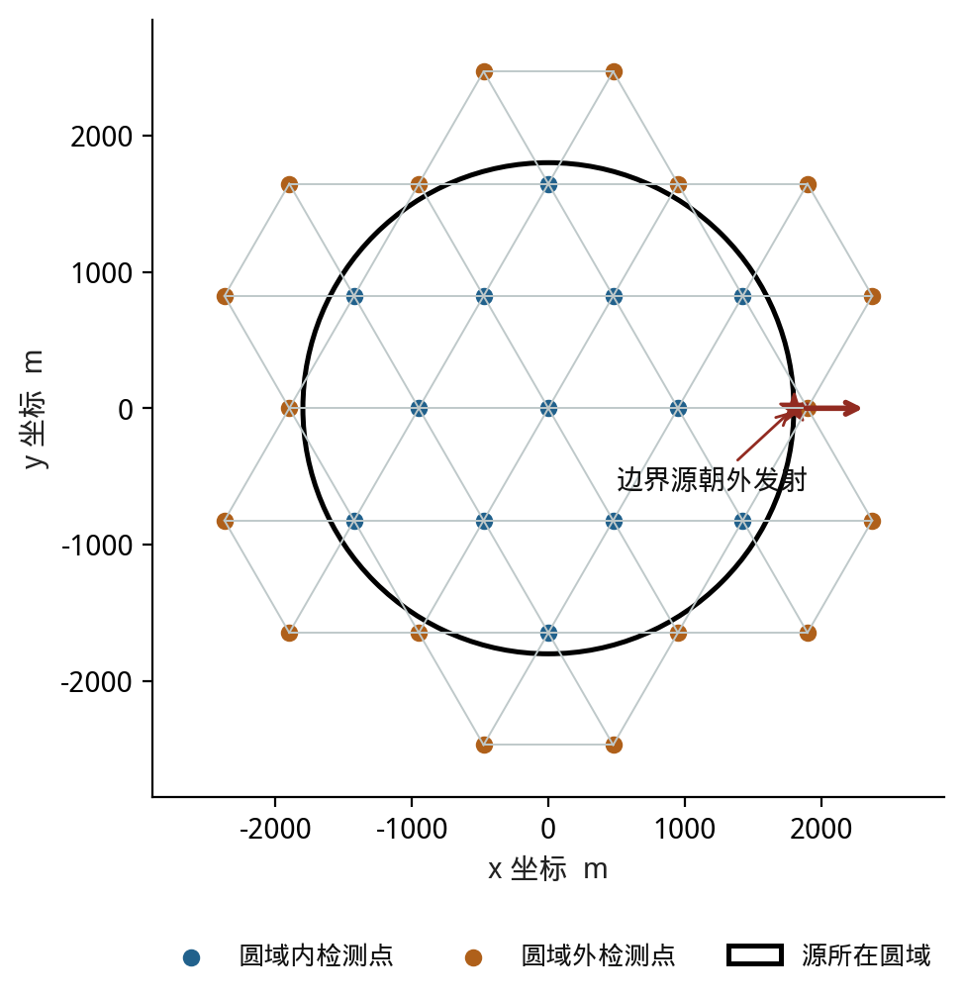
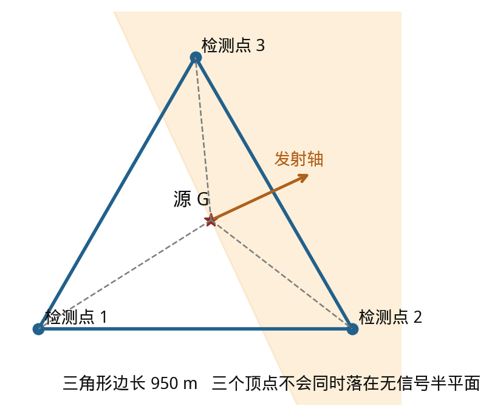
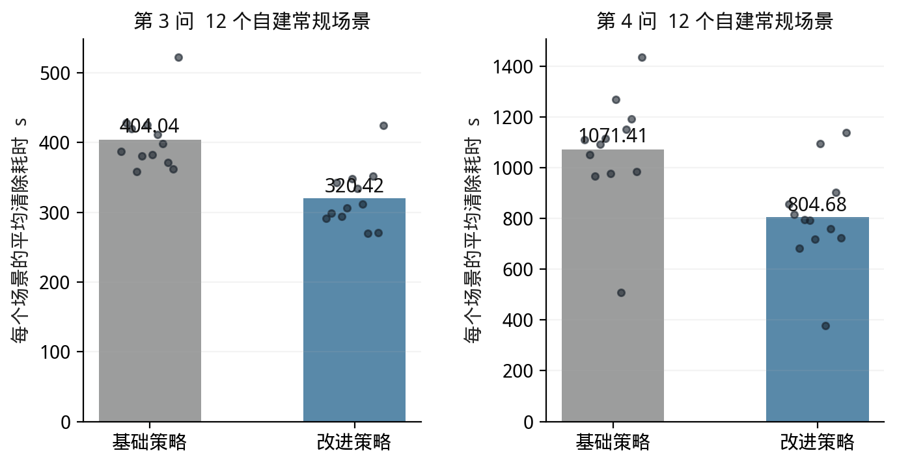
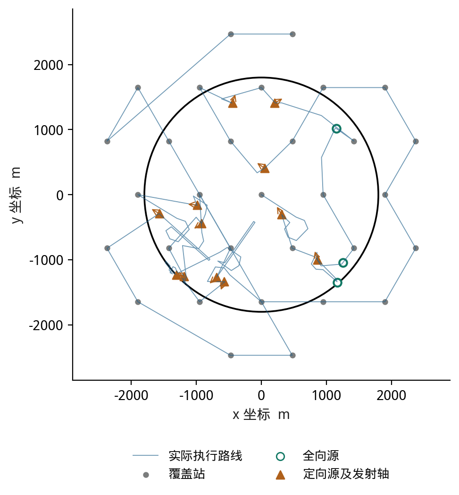

# 无线电干扰源自动定位与清除建模详解

2026 年 B 题完整解题方案与逐问讲解

本文依据上传的《B题.pdf》《附件1.docx》《附件2.docx》，按读题分析、模型选择、数据处理、算法实现、数值验证和论文写作的顺序完成解答。四问共用一条主线：把带误差的方向变成可能区域，选择能缩小区域的检测位置，再通过有覆盖保证的搜索找到所有源。

第一问的关键结论是：定位区域直径的一半，通常不能直接作为覆盖半径。第二问给出一个具有接收保证的第二检测点候选区。第三问构造七个检测点覆盖全向源所在圆域。第四问构造包含区域外检测点的三角网格，覆盖任意未知的 180° 发射方向。实际动作采用滚动选点，并用有限光学覆盖保证已发现目标能够被清除。

数值验证使用独立编写的本地模拟器，共比较 32 个场景、64 次策略运行，所有运行均清除全部源。常规场景下，第三问平均耗时从 404.04 秒降至 320.42 秒，第四问从 1071.41 秒降至 804.68 秒。这里的平均耗时先按每局总虚拟时间除以该局清除数量，再对 12 局取平均。上述数字不是官方成绩；官方演练和六次正式测试仍需在参赛者已登录的模拟器上执行。

## 1 题目分析与任务拆解

### 1 1 按题意逐项识别条件

本题是全国大学生数学建模竞赛题。虽然前面的讨论沿用了“美赛”的建模流程，本文的参数、输出和测试要求均以这次上传的 B 题及接口附件为准。

| 题意或规则 | 信息类别 | 模型含义与关键联系 |
|---|---|---|
| 人工排查效率低且可能进入危险环境 | 背景信息 | 解释自动定位的任务，不据此增加障碍、地形或能耗模型 |
| 源位于半径 1800 m 的圆域 | 已知条件 | 限制未知源的位置，不限制机器狗必须留在圆内 |
| 源数量未知，第三四问为 10 至 16 个 | 已知及约束 | 必须证明没有遗漏；清除 10 个后不能直接结束 |
| 20 个频道，每频道至多一个源 | 已知条件 | 频道可直接作为目标标识，不需要多目标数据关联 |
| 源位置、频道及参数不随时间变化 | 已知条件 | 不建立移动目标预测模型；历史有效读数可累积 |
| 全向源覆盖 360°，定向源覆盖 180°且含边界 | 物理与场景约束 | 第四问增加未知发射轴，检测覆盖需考虑方向 |
| 有效接收半径在 1000 至 1500 m | 参数范围 | 有信号意味着距离不超过 1500 m；1000 m 是接收半径下界，不是距离下界 |
| 示向度误差在正负 1°，同地点误差固定 | 测量规律 | 使用有界误差集合；同地点多次平均不能消除偏差 |
| 示向度按 x 轴逆时针计，范围为 0°至 360° | 数据规则 | 统一坐标和弧度换算，正确处理跨越 0°的角度 |
| 返回示向度保留两位小数 | 数据规则 | 实现中保守采用 1.005°半角吸收可能的舍入影响 |
| 移动速度 5 m/s，移动中不能检测 | 资源约束 | 移动时间和静止检测时间相加，不能并行扣除 |
| 每次检测 5 s，换频道另加 1 s | 时间规则 | 同地点批量扫描；优先检测当前频道可省一次切换 |
| 20 m 内可精确定位并清除 | 操作约束 | 清除点必须到所有仍可能的位置都不超过 20 m，才能保证成功 |
| 光学定位 3 s，成功清除再加 2 s | 时间规则 | 清除成功花 5 s，失败花 3 s；失败同样记入总耗时 |
| 5 m 内且有信号时返回 near | 观测分支 | 没有示向度是正常现象，可在原地直接清除 |
| 接口仅有 enter、measure、clear、exit | 软件规则 | 移动和换频道由动作隐含触发，不添加额外指令 |
| clear 不改变测向机频道 | 状态规则 | 清除对象的频道与接收机当前频道分别记录 |
| 第三四问都要求演练与三次正式测试 | 输出要求 | 分别报告统计指标，正式加密日志由官方模拟器导出 |

核心原理是平面几何、集合交会、覆盖设计和在线决策。题目没有给出场强数值，也没有给出衰减公式的参数，不能把“场强随距离衰减”扩写成一套可以直接反演距离的数据模型。

### 1 2 每一问真正要完成什么

| 小问 | 直接目标 | 隐含目标 | 应交付的结果 |
|---|---|---|---|
| 第一问 | 计算多边形定位区域直径，判断相应圆能否覆盖 | 为可靠清除确定正确的几何指标 | 半平面模型、算法、反例和覆盖判据 |
| 第二问 | 选择第二检测点并给出候选区域 | 建立后续在线选点规则 | 候选区域公式、选点准则和示例 |
| 第三问 | 找到并清除全部全向源，减少总时间 | 同时解决发现、定位、行走和停机 | 在线策略、程序、演练统计及正式结果 |
| 第四问 | 在发射方向未知时完成同一任务 | 修正“没有信号”的解释和覆盖逻辑 | 方向覆盖证明、改进策略及相同测试输出 |

第一问属于机理分析和计算几何；第二问属于带几何约束的优化决策；第三问属于覆盖搜索与在线路径决策；第四问属于带部分可观测状态的覆盖搜索和优化决策。路径可以画成网络，但本题不需要为了套用题型额外建立复杂网络模型，也不需要在没有训练集的情况下强行加入 LSTM。

各问之间的依赖是：设备规则决定误差区域，误差区域决定检测点和清除点，单源定位被嵌入全域搜索，定向特征再改变发现目标的覆盖条件。本题适合“机理确定约束，交互数据更新状态，演练数据调整策略参数”。

## 2 数据预处理与统一记号

### 2 1 附件中实际有什么数据

压缩包含一份四页题目 PDF 和两份 Word 说明，没有源坐标清单、CSV、Excel 或官方测试案例。因而不能报告“原始样本有多少缺失值”这类尚未观察到的统计量，也不能把官方隐藏状态当成可直接使用的数据集。真正需要处理的是运行过程中逐次生成的 JSON 反馈。

| 数据对象 | 字段或规模 | 类型 | 处理方式 |
|---|---|---|---|
| 固定场景参数 | 圆域、速度、时间、接收范围等 | 实数、整数和规则 | 统一采用 m、s；角度只在计算三角函数时转弧度 |
| 动作请求 | request_id、position、channel、动作路径 | 字符串、坐标、整数 | 校验类型、范围和唯一性，原样保留日志 |
| 检测反馈 | no_signal、near、direction | 分类值 | 按分支建模，不转换成连续数值 |
| 示向度 | 仅 direction 分支返回 svd_deg | 有界角度 | 保留两位小数读数，以三角向量处理角度环绕 |
| 时间反馈 | virtual_time_s、剩余现实时间 | 非负数 | 检查单调性，保留服务器有效时间，另计真实运行时间 |
| 已发现源的状态 | 最多 20 个频道及各自历史读数 | 小规模动态记录 | 更新可行域、清除状态与动作历史 |

因此，本题需要预处理，重点在协议语义和状态一致性。需要重点避免：把结构性缺失填为零、把重复读数误当作独立信息、将度数直接传入弧度三角函数、混淆虚拟时间与程序运行时间，以及把 clear 当成接收机换频道。

### 2 2 缺失值和重复值应该怎样处理

`near` 与 `no_signal` 没有示向度，是接口规定的正常分支。前者直接触发清除，后者表示当前收不到该频道；二者都不能以零度、均值或插值替代。只有 `direction` 却缺少合法示向度，才是需要检查的异常反馈。

相同 request_id、相同请求体的重试是同一个动作，不重复累计费用。相同位置但不同 request_id 的重复检测则是两个收费动作；其读数可能完全相同，不能删掉费用，也不能把它们当作独立样本缩小误差半角。accepted 为 false 时，返回的 virtual_time_s 等于零只是拒绝标记，状态应保留上一次有效时间。

本地示例日志的真实审计结果如下。示向度缺省数全部来自正常分支，处理前后均不填补；原始日志不被修改。无效记录数按字段、角度和时间规则检查，不能据此推断官方日志也一定没有异常。

| 示例 | 原始动作数 | 有效示向度 | 按协议缺省 | 异常记录 | 填补个数 |
| --- | --- | --- | --- | --- | --- |
| 第3问 常规 | 102 | 36 | 48 | 0 | 0 |
| 第3问 压力 | 141 | 38 | 83 | 0 | 0 |
| 第4问 常规 | 566 | 30 | 344 | 0 | 0 |
| 第4问 压力 | 825 | 25 | 438 | 0 | 0 |

### 2 3 Python 与 MATLAB 的选择

| 处理任务 | Python 实现 | MATLAB 实现 |
|---|---|---|
| JSON 行读取 | pathlib、json，保留 None | fileread、jsondecode，数值表中使用 NaN 并保留分支 |
| 单位和角度 | np.deg2rad 或 math.radians | deg2rad，或直接使用 cosd 和 sind |
| 字段校验 | math.isfinite、类型与范围检查 | isfinite、isfield、assert |
| 读数交会 | NumPy 与半平面裁剪 | 矩阵运算及相同几何公式 |
| 时间与重复动作 | request_id 字典和独立状态 | containers.Map 和状态变量 |
| 文件路径 | Path 和原始字符串 | fullfile 和 string 路径 |

主程序选用 Python，便于对接 HTTP、记录日志和自动重复实验。MATLAB 适合矩阵推导和交互绘图，但部分优化工具有许可要求。支撑包提供完整 Python 求解器及 MATLAB 预处理对照函数；本环境只执行验证了 Python 版本，不把 MATLAB 对照代码描述为已实测。

路径应先解压后设置。常见问题是把压缩包内部目录当成本地文件，把 Windows 反斜杠当成转义字符，或者在不同工作目录下使用同一相对路径。Python 推荐从脚本所在目录构造绝对路径；MATLAB 推荐 fullfile。含空格的命令行路径应加引号。

预处理没有一个可以凭空给出的“评分占比”。它对本题属于基础正确性要求：错误填补一个无信号读数就可能删除真实源，错误处理一次换频道就可能改变目标函数。论文应说明具体规则、验证证据和结果影响；完整代码放支撑材料，正文只展示关键分支及双语言差异。

### 2 4 统一变量

用 G 表示未知源坐标，S 表示检测位置，θ 表示反馈示向度，δ 表示误差半角，P 表示仍可能的源位置集合。D 表示定位区域直径，c 和 r 表示最小包围圆的圆心与半径。R 为单个源未知的接收半径，α 为定向源未知的发射轴角度。数学推导默认 δ 为 1°，程序取保守值 1.005°。

$$
\Omega=\{G\in\mathbb R^2:\|G\|\le1800\},\qquad 1000\le R\le1500.
$$

## 3 第一问 从方向误差到可靠的清除区域

### 3 1 先理解为什么会出现多边形

一次检测给出的不是一条精确射线，而是一条中心方向左右各偏差约 1°的窄扇形。真源必须在这个扇形里。换一个地点测量，又得到一个扇形。把所有扇形叠在一起，同时满足全部读数的部分就是定位区域。只考虑这些直线边界时，其交集是凸多边形，也可能为空、无界或退化成线段。

不能在程序中随意套一个大正方形，就把原本无界的交会结果解释成有限定位精度。若加入题目的源所在圆域或接收距离上界，集合会带圆弧；本文将“纯示向度形成的多边形”和“叠加场景先验后的可行集合”区分处理。

### 3 2 把每次读数写成两个半平面

定义单位方向向量 u，二维叉积记为方括号。第 i 次读数对源位置的限制为：

$$
u(\varphi)=(\cos\varphi,\sin\varphi),\qquad [a,b]=a_xb_y-a_yb_x.
$$

$$
[u(\theta_i-\delta),G-S_i]\ge0,\qquad
[u(\theta_i+\delta),G-S_i]\le0.
$$

这两个不等式既确定左右边界，又保留向前的射线方向。使用 sin、cos 和叉积可以自然处理 359°附近跨越零度的读数，也避免斜率在竖直方向无定义的问题。整理后得到线性不等式组 AG≤b，其交集就是 P。

基础算法先用线性规划判断是否存在可行点，再分别检查 x、负 x、y、负 y 方向能否无限增大。若集合有界，枚举边界直线两两交点，只保留满足全部不等式的交点，去除数值重复点并按凸包顺序排列。交会区域若只有一个点，直径为零；若是一条线段，取端点距离；若为空，需要检查数据和模型，不能自动删掉“不好用”的读数。

### 3 3 为什么只算顶点就够了

固定区域内一点到另一点的距离，在凸多边形上的最大值可以在顶点取得。对两个点分别使用这个性质，区域直径就等于最远的一对顶点之间的距离。

$$
D(P)=\max_{G,H\in P}\|G-H\|=\max_{1\le j,k\le m}\|V_j-V_k\|.
$$

基础方案枚举所有顶点对，复杂度为 O(m²)，本题规模小且便于复核。改进方案对有序凸多边形使用旋转卡壳，按相对支撑边移动对踵点，在线性时间内计算直径；平行边的并列情形也要检查。支撑代码同时保留两种方法，已在 100 个随机凸包上核对一致。

### 3 4 直径相同的圆并不总能覆盖

取边长 40 m 的等边三角形。区域直径为 40 m，但能覆盖整个三角形的最小圆半径为 40 除以根号 3，约 23.094 m，大于 20 m。因此，无论怎样选择圆心，都不能用直径 40 m 的圆覆盖这个区域。

这个反例也能由本题的测向交会产生，并非脱离场景的随意图形。以下三个检测点分别反馈 1°、121°、241°，误差半角取题设的 1°；三个扇形交集恰好是上述等边三角形。

| 检测点 | x 坐标 m | y 坐标 m | 示向度 |
|---|---|---|---|
| S1 | −1000.0000 | 0.0000 | 1° |
| S2 | 540.0000 | −866.0254 | 121° |
| S3 | 520.0000 | 900.6664 | 241° |

三个顶点分别为 (0,0)、(40,0)、(20,34.6410)。例如取源在三角形重心，各次真实方位均落在允许误差范围内，距离也可满足题设接收条件。



### 3 5 应当使用什么清除判据

正确的问题是：找一个清除点，使它到最不利可能位置的距离尽量短。这正是最小包围圆问题。

$$
\begin{aligned}
r_* &= \min_c\max_{G\in P}\|G-c\|,\\
r_*\le20&\ \Longrightarrow\ \|G-c_*\|\le20\quad(\forall G\in P).
\end{aligned}
$$

对凸多边形只需包住全部顶点。最小包围圆由至多三个支撑点确定，程序因此枚举点对中点和三点外接圆心，再以所有顶点到圆心的最大距离核验覆盖。这是便于审计的小规模实现，不把它误称为线性时间算法。工程上使用 19.75 m 作为提前清除阈值，留出 0.25 m 的数值余量。[4]

必要条件 D≤40 m 不足以单独保证清除；在平面上 D≤20√3 m 可作为充分条件，但直接计算最小包围圆通常更清晰。最小外包圆与最大内切圆不同：后者只保证圆在区域里面，不能保证区域内的真源靠近圆心。[3][4]

本问的基础方案是半平面交会加顶点对枚举；改进方案是旋转卡壳与最小包围圆联合计算。真正的改进价值在于把“区域有多长”转成“能否可靠清除”。局限主要来自近乎平行的边界及数值退化，应使用方向向量、容差检查、空集判别和穷举结果交叉验证。

## 4 第二问 第二检测点应该选在哪里

### 4 1 为什么不能只沿原方向继续走

只有一条带误差的示向度时，横向位置已有一定限制，沿示向方向的距离却仍不确定。第二次检测若与第一次几乎共线，两条误差带就会形成很长的交集。适当横向移动可以增加交会角，但移动过远会增加时间，甚至越出有效接收范围。

小角度下，第 i 个检测点距离源约 dᵢ 时，横向误差尺度约为 dᵢδ，其中 δ 要用弧度。两条示向的交会角越接近 0°或 180°，沿长轴方向的误差放大越明显，主要受 1 除以交会角正弦的绝对值影响。90°是固定距离等理想条件下的好几何形态，不能在距离未知、移动收费的本题中直接宣布它总是最优。

### 4 2 先给第二检测点一个有接收保证的候选区

设首次位置为 S，首次中心方向为 u，先忽略圆域边界带来的额外收缩。源可能位于 S+d·u(β)，其中距离 d 在 0 至 1500 m，β 位于测量误差区间。第一次已经有信号，所以实际 R 还满足 R≥d。于是可利用的下界是 R≥max(1000,d)。

下面的三个圆盘交集给出一个通用、充分的第二检测点候选区。B(c,r) 表示包含边界的圆盘。

$$
\begin{aligned}
\mathcal C={}&B(S,1000)\cap B(S+1000u(\theta-\delta),1000)\\
&\cap B(S+1000u(\theta+\delta),1000).
\end{aligned}
$$

为什么成立：对误差区间内任意真实方向，候选点 Q 到 S 和到该方向 1000 m 点的距离均不超过 1000 m。当 d≤1000 时，中间源点位于这条线段上，由圆盘的凸性得到距离不超过 1000 m；当 d≥1000 时，下式给出距离不超过 d。两个端点方向已经覆盖区间内最不利的投影，因而只需上述三个圆盘。

$$
\|Q-S-du\|^2-d^2=\|Q-S\|^2-2d(Q-S)\cdot u\le0.
$$

所以 Q 位于候选区内就保证能接收到全向源，或在足够近时得到 near。这个结论没有假设真实接收半径等于 1000 m，也不要求知道首次到源的距离。若利用源所在圆域和更多历史读数，还可以扩大可选区域或减少移动；因此该候选区是便于实现的充分集合，不是所有可行点的最大集合。

### 4 3 基础方案 向前移动并加入横向偏移

在首次检测点为原点、示向度为 0°的局部坐标中，可取 (750,500) 或 (750,−500) 作为易于解释的基础候选。这两点都在接收保证区域内，移动距离约 901.39 m，移动时间约 180.28 s。遇到其他首次坐标与示向度，只需旋转和平移这两个向量，再根据当前整体路线选代价较低的一侧。

这里特意包含向前分量：如果从首次检测点纯粹垂直移动，而真源恰在其接收半径边界上，新的距离会增大，可能立即失去信号。第二问没有给出具体坐标或真实距离，所以合理答案是条件化策略和候选区域，不能写出一个对所有输入都通用的绝对坐标。



### 4 4 改进方案 有界误差集合与有限情景前瞻

先在候选区生成有限个待选点；再从当前可能区域选取代表源位置，并为第二次读数设置多个允许误差情景。对每种组合重新交会，计算第二次测量后的包围圆半径。可以优先最小化这些情景中的最大半径，也可以加入移动费用。

$$
Q_*\in\arg\min_{Q\in\mathcal C_{\rm cand}}
\left\{\frac{\|Q-S\|}{5}+5+\lambda\max_{\omega\in\mathcal W}r(P_2(Q,\omega))\right\}.
$$

其中候选集、情景集和权重都是算法设计量，不是题目给定数据。距离除以 5、检测费用 5 的单位均为秒，λ 的单位应为秒每米；应使用演练调整，而不是写成无量纲随意相加。主程序的轻量前瞻使用 0.4 s/m；第二问独立演示则仅比较有限情景的最大包围圆半径。

独立演示取 17 个距离、3 个首次方向边界位置和3个第二次误差情景，在给定离散候选点中计算得到：

| 第二点局部坐标 m | 移动时间 s | 样本最大包围半径 m | 解释 |
| --- | --- | --- | --- |
| (750, 500) | 180.28 | 65.17 | 基础示例 |
| (750, 650) | 198.49 | 57.63 | 本次候选中半径最小 |
| (600, 800) | 200.00 | 61.68 | 候选区边界上的例子 |

在这个有限集合中，(750,650) 的样本最坏包围半径约为 57.63 m，比基础示例更小，代价是多走约 18.22 s。它还不能保证直接清除，需要继续定位。这不是连续候选空间、全部误差和全部距离上的全局最优证书；未采到的状态可能更不利。

基础方案的优势是解释简单、接收有保证；不足是不能根据当前区域形状调整。改进方案把几何区域与移动代价连接起来，能根据反馈更新；局限是采样精度和计算量。规避办法是保留严格几何可行域，只让采样影响“先去哪”，不让采样决定“哪里绝不可能有源”。

本问求解流程是：已有读数形成可能区域；检查是否已能清除；否则构造接收候选区；生成并评分第二检测点；获取新反馈；更新交会；用最小包围圆验证。每一步的输出分别为区域、多边形顶点、候选坐标表、动作和新的半径。

## 5 第三问 全向源的完整搜索和清除

### 5 1 先写对优化目标

首先保证全部源清除，在这个前提下减少总虚拟时间。平均清除时间是事后评价指标，不能为了降低平均数只处理容易找到的几个源。总路程记为 L，公式中的计数下标 m、s、c、f 依次表示检测、换频道、清除成功和清除失败，则：

$$
T=\frac L5+5N_m+N_s+5N_c+3N_f.
$$

光学定位的 3 s 已包含在成功时的 5 s 中，不能重复收费。程序运行时间另外计量；机器狗在虚拟世界走一千米，不需要让程序实际等待两百秒。本文对每次本地运行都以动作计数和累计路程重建时间，与模拟器有效反馈核对，误差小于 0.002 s。

### 5 2 七个检测点为什么不会漏源

在原点设一个检测点，再在半径 900√3 m 的圆周上等角放置六个检测点。

$$
S_0=(0,0),\qquad S_{k+1}=900\sqrt3\,u(60^\circ k),\quad k=0,1,\ldots,5.
$$

| 检测点 | x 坐标 m | y 坐标 m |
|---|---|---|
| S0 | 0.000 | 0.000 |
| S1 | 1558.846 | 0.000 |
| S2 | 779.423 | 1350.000 |
| S3 | −779.423 | 1350.000 |
| S4 | −1558.846 | 0.000 |
| S5 | −779.423 | −1350.000 |
| S6 | 779.423 | −1350.000 |

证明分两段。半径不超过 900 m 的源由中心点覆盖。其余源的极径记为 ρ，总能找到一个环形检测点，使两者极角差不超过 30°。令环形布点半径 a=900√3，则到这个点的距离平方不超过下式：

$$
d^2\le\rho^2+a^2-2a\rho\cos30^\circ
=\rho^2+2430000-2700\rho.
$$

这个关于 ρ 的二次式在区间 [900,1800] 上是凸函数，最大值在端点取到，而两个端点值均为 810000。因此全圆域任一点到至少一个检测点的距离不超过 900 m，比最小接收半径 1000 m 还留有 100 m 余量。七点是一个有证明的可行构造，本文不宣称它是全部可能布点中的数量最少方案。



### 5 3 基础策略 逐站扫描后定位已发现目标

机器狗从中心出发，在覆盖站对所有尚未清除的频道各测一次。收到 direction 就建立或更新该频道的可能区域；收到 near 就在原地清除。完成本站扫描后，依次定位刚发现的源，再去下一站。

单源定位将新的示向扇形与历史区域交会，同时利用源圆域和接收上界。程序用外切正 64 边形包住圆形约束，确保离散化不会误删真源；外切而非内接的区别直接关系到是否漏解。包围圆半径不超过 19.75 m 就去圆心清除；否则变换检测位置。普通定位最多连续尝试六次，然后启用下面的有限覆盖。

### 5 4 改进策略 滚动选点与路线更新

覆盖站保持不变。完成本站发现的一批目标后，再从未访问站中选择较近的一站；同一批目标中，每次先处理估计清除点较近的源；同一位置优先测当前频道；单源定位按照第二问的前瞻思路选择信息量和移动代价较好的位置。

当包围半径在 19.75 m 至 40 m 之间时，改进策略允许在圆心试一次光学清除。它可能成功，但属于明确计费的尝试，不能因为 D≤40 m 或 r≤40 m 就声称必然成功。失败只多花 3 s，仍保留完整可能区域，继续定位或有限覆盖。这个选择的作用是用小额尝试节省一次检测和绕行。

### 5 5 已发现目标如何在有限步内清除

只要获得过一次 direction，源就被限制在长度不超过 1500 m、半角 1.005°的窄扇形中。以首次中心方向为纵轴，其横向偏离最多为 1500sin(1.005°)，约 26.31 m。

用边长 25 m 的正方形覆盖这个窄区域：纵向 60 格，横向三行，总计至多 180 格。只保留与当前保守可能区域相交的格子，然后逐个在格心尝试清除。任一格内的源到格心的距离都不超过：

$$
d_{\max}=\frac{25\sqrt2}{2}\approx17.68\,\mathrm{m}<20\,\mathrm{m}.
$$

真源所在格不会被删掉，访问该格心时必然成功。这一方法不依赖后续是否还能收到信号，因此也能用于第四问。程序比较最近邻路线和四种蛇形遍历路线，采用全程路长较短的一条。保留格子只是完整蛇形路线的子序列，内部遍历长度不超过 4475 m，既减少绕行，也保留有限路长上界。

### 5 6 什么时候可以结束

若已成功清除 16 个源，可以利用题设上界提前结束。否则必须完成全部覆盖站对所有尚未清除频道的扫描，并处理完所有有信号的目标。假设还剩一个未清除源，七点覆盖必然使它在至少一站被检测到，而后续有限覆盖必然清除它，产生矛盾。因此满足该条件时可以确认没有遗漏。

只清除了 10 个、连续几次没收到信号、或“很久没有新发现”，都不是充分结束条件。完整策略需要同时保存频道状态和已访问覆盖站，而不仅是当前最近的目标。

本问的基础方案是七点覆盖加顺序处理，优势是终止条件清楚、代码简单；改进方案是覆盖保证与滚动决策结合，减少不必要移动和扫描。局限是就近选择不能保证全局最短，七点站仍可能存在冗余访问。演练用于比较这些代价，不能用有限次成功替代覆盖证明。

## 6 第四问 发射方向未知时如何避免漏检

### 6 1 无信号的含义发生了变化

全向源只受距离限制。定向源还要求检测点处在以源为边界点、朝发射轴方向的半平面中。若发射轴角为 α，则有信号需要同时满足：

$$
\|S-G\|\le R,\qquad u(\alpha)\cdot(S-G)\ge0.
$$

因此 no_signal 可能来自频道没有源、目标已清除、距离过远或处在发射背面。第三问在未清除频道上可以利用半径 1000 m 内的无信号信息排除一些位置，第四问不能直接这样删区域。收到正读数后形成的示向度约束仍然有效，第一问的方法可以继续使用。

边界情形尤其重要。设源在 (1800,0)，朝正东方向发射。在源所在圆域内部，除源点本身外，所有位置的 x 坐标都小于 1800，均处在背面。如果强行要求机器狗一直留在源圆域内，就无法用有限个内部采样点保证发现它。题目只约束源的位置，允许机器狗到圆外检测。

### 6 2 用三角网格保证任意方向都能被看到

建立边长 a=950 m 的等边三角格点，并保留距原点不超过 1800+a=2750 m 的格点。采用下式坐标可得到 31 个检测点：

$$
S_{ij}=a\left(i+\frac j2,\frac{\sqrt3}{2}j\right),\qquad
i,j\in\mathbb Z,\quad \|S_{ij}\|\le1800+a.
$$

源所在圆域被无限三角网格铺满，每个源至少属于一个三角单元。源到该单元三个顶点的距离均不超过边长 950 m，所以三个顶点都在最小接收距离范围内。又因为源在三角形内部或边界上，存在非负重心系数使：

$$
G=\lambda_1S_1+\lambda_2S_2+\lambda_3S_3,
\qquad \lambda_i\ge0,\quad\lambda_1+\lambda_2+\lambda_3=1.
$$

如果三个顶点全在发射背面，它们相对源的向量与发射轴点积全为负，按这些系数加权后仍为负。但加权向量恰好为零，点积应为零，矛盾。因此至少一个顶点位于发射半平面，且距源不超过 950 m，必然检测到信号。题目明确包含发射角边界，这使等号情形也成立。

为什么只保留到 2750 m 的有限个格点就够了：所需顶点距源不超过 950 m，源距原点不超过 1800 m，三角不等式给出顶点距原点不超过 2750 m。圆外检测点正是覆盖边界朝外发射源所需的部分。



### 6 3 基础方案与改进方案如何衔接

基础方案按固定顺序扫描这 31 个点，在每点检测未清除频道，再使用正读数交会和单源定位。某目标暂时失去信号时，历史可能区域保留；连续定位没有取得足够进展，就使用 25 m 方格的光学覆盖。清除是否成功与发射方向无关，因此该分支可以结束定位僵局。

改进方案保留全部覆盖站，采用就近访问、目标优先级和有限情景选点，并比较有限覆盖的行走路线。其方法融合发生在“覆盖保证”和“动作优化”之间：前者负责不遗漏，后者负责少花时间。代码的情景前瞻主要评价可能收到示向度时的定位质量，并没有完整积分所有发射轴造成的无信号分支，因此只属于启发式评分。

进一步的研究可以把源位置、接收半径和发射轴组成联合可行集合，以正负读数共同约束这些变量，再选择能区分更多状态的位置。但用粒子或离散角度近似时不能把样本缺失当成绝对排除。交付程序没有实现这一更复杂的联合集合，不将它写作已完成的算法创新。



### 6 4 完整性与时间限制

方向覆盖证明保证每个未清除源至少在一站被发现；正读数外包区域不丢失真源；有限方格覆盖保证发现后的清除。三个条件共同给出第四问的完整性。与第三问相同，清除数量达到 16，或者所有覆盖站对剩余频道均已扫描且发现目标全部处理，才允许结束。

在理想协议反馈下还可以给出保守的虚拟时间上界。覆盖站最多 31 个，单源普通定位最多六次，额外试探清除最多一次，有限覆盖最多 180 格。所有实际动作位置均在半径 2750 m 内。将覆盖站间移动、每源七次普通移动以及每源有限覆盖分别粗略上界，再以每次清除都花 5 s 估计，可得约 207996 s，即不足 58 小时，低于题设 100 小时虚拟上限。实际局通常远短于这个松上界。

现实 20 分钟限制还取决于计算机和通信。程序读取 enter 返回的实际剩余时间，预留 15 s 退出余量；遇到截止或协议矛盾就保留日志并报告未完成。虚拟世界中的完整性证明不等于对任意故障、网络延迟和外部中断的完成保证。

## 7 本地计算结果与验证

### 7 1 实验来源与可复现设计

本地模拟器按照题设的接收范围、角误差、停止检测、换频道、清除和时间规则独立编写。策略对象只得到接口反馈；真源坐标仅由模拟器用于产生观测和结束后的评估、绘图，不用于在线决策。源坐标及误差分布的生成方式属于本文实验设计，不声称与官方案例分布相同。

每问设计 12 个常规场景和 4 个联合压力场景，每个场景分别运行基础与改进策略，总计 64 次。常规位置按圆域面积均匀生成，接收半径在允许区间内均匀生成，误差为有界确定性空间函数，同地点重复读数保持不变。压力场景使用最小接收半径、正负 1°边界误差、源位于圆域边界，并令定向源朝区域外发射。第四问每个场景都同时包含全向源和定向源。

同一场景的两套策略共享完全相同的源参数与误差函数；记录的场景摘要校验这一点。两者访问位置不同，接收到的具体误差可以不同，这正是固定空间误差环境下应有的比较方式。

### 7 2 四类实验的结果

| 问题 | 场景 | 策略 | 局数 | 清除比例 | 每源均值 s | 最差局均值 s |
| --- | --- | --- | --- | --- | --- | --- |
| 3 | 常规 | 基础 | 12 | 100% | 404.04 | 522.68 |
| 3 | 常规 | 改进 | 12 | 100% | 320.42 | 424.48 |
| 3 | 联合压力 | 基础 | 4 | 100% | 336.83 | 370.06 |
| 3 | 联合压力 | 改进 | 4 | 100% | 286.15 | 294.54 |
| 4 | 常规 | 基础 | 12 | 100% | 1071.41 | 1436.28 |
| 4 | 常规 | 改进 | 12 | 100% | 804.68 | 1138.09 |
| 4 | 联合压力 | 基础 | 4 | 100% | 1187.74 | 1337.86 |
| 4 | 联合压力 | 改进 | 4 | 100% | 916.21 | 1046.21 |

全部运行的清除比例为 100%。常规场景中，改进策略在第三问和第四问的平均耗时分别降低 20.69% 和 24.90%。这是自建有限样本上的描述性结果，不是官方成绩或全局最优证明；不能据此承诺相同比例适用于官方场景。



| 常规场景 | 平均路程 km | 平均检测次数 | 平均失败清除次数 |
| --- | --- | --- | --- |
| 第3问 基础 | 24.68 | 103.58 | 0.00 |
| 第3问 改进 | 18.94 | 96.83 | 0.92 |
| 第4问 基础 | 62.21 | 289.17 | 177.58 |
| 第4问 改进 | 44.67 | 301.92 | 85.75 |

从代价构成看，主要收益来自路程缩短。第四问改进策略的检测次数未必减少，但较短的路程以及较少的失败清除仍可使总耗时下降。因此不应把“检测次数最少”直接当成题目的完整目标。支撑包同时保留每局原始汇总，便于检查均值、最差场景和例外。



图7中的源位置和发射轴来自该自建场景结束后的真值导出，只用于解释路线。在线策略从未获得这些坐标。图中的反复接近和局部折返反映定位与定向遮蔽的代价，不能将该路线描述为最短路径。

### 7 3 验证和敏感性

已完成的必要验证包括：等边三角形反例、100 个随机凸包的直径算法对照、示向跨零度、前向射线约束、空集与无界集合、退化线段、第二检测点接收条件、两种布点的几何采样检查，以及附件给出的时间序列 105、111、194、199 s。覆盖的连续正确性由前文证明支撑，采样只用于发现实现错误。

误差半角增大时，可行区域通常变宽，检测动作和有限覆盖需求会上升。1500 m 处的扇形全宽为 3000sinδ：当 δ 为 0.5°、1°、1.005°和1.5°时，约为 26.18、52.36、52.62 和 78.53 m。程序中的三行方格及 180 格上界对应 1.005°，修改误差范围时必须同步调整覆盖行数，不能只改一个绘图参数。

三角网格边长必须不超过最小接收半径；本文用 950 m 为距离判定留出 50 m 余量。若改成大于 1000 m，三个顶点都在接收范围内的证明立即失效。路线和动作数量固定时，速度影响由 T(v)=L/v+C 给出，移动部分随速度反比变化，静止动作部分不变。

联合压力测试同时改变了位置、半径和误差，能检查不利组合，但不能据此分离每个因素的单独因果影响。若继续做正式论文的单因素敏感性，应固定场景与其他参数逐项改变；不把本次联合测试冒充单因素实验。

## 8 官方测试与论文使用方式

### 8 1 哪些部分已经完成

数学模型、四问解释、覆盖证明、可运行策略、独立模拟器、本地成对实验、协议状态检查和结果图表已经完成。第一二问本来没有给出一组指定数值输入，本文已给出一般算法、候选区域及明确标注的构造示例。

第三四问题设要求的官方演练统计、三加三次正式案例编码和加密日志没有在当前环境运行。上传包中没有模拟器程序，也没有可直接使用的已登录会话。这些内容必须来自参赛者实际运行，不可使用本地种子号、场景摘要或本地平均值代填。

| 所需记录 | 当前状态 | 取得方式 |
|---|---|---|
| 第三问官方演练统计 | 未运行 | 在模拟器选择问题3演练，结束后读取总源数 |
| 第三问三次正式结果 | 未运行 | 演练充分后逐次正式测试，按题设表1记录 |
| 第四问官方演练统计 | 未运行 | 在模拟器选择问题4演练并检验不同发射方向 |
| 第四问三次正式结果 | 未运行 | 导出对应正式加密日志并保留文件名 |

### 8 2 可直接复现的运行方式

在代码包目录执行以下命令即可运行本地验证。默认只运行自建模拟器，不连接官方测试。

```bash
python -m pip install -r requirements.txt
python validate.py
python run.py --question 3 --seed 0
python run.py --question 4 --seed 0
python benchmark.py --cases 12 --output results_reproduced
```

官方接口连接步骤在 README 中单独列明。需要先由参赛者在模拟器界面选择正确的问题、演练或正式模式，确认已就绪，再显式启动客户端。程序仅使用四个规定接口；重试复用相同请求标识，不并发发动作，不额外等待虚拟检测时间。正式加密日志由官方模拟器导出，本地 JSONL 不能替代它。

按上传附件，新的演练和正式测试启动截止为 2026 年 9 月 13 日北京时间 17:30，建议在 15:30 前完成正式测试。执行时还应核对当前模拟器提示。程序使用剩余现实时间而非假定每局都能用满 1200 s。[1][2]

### 8 3 写入论文时怎样组织论证

摘要应先写四问的关键方法与已验证结论，再说明实测来源。问题重述只保留决定模型的条件。模型建立部分按“误差交会、主动选点、全向覆盖、方向覆盖”的依赖展开；每次增加复杂性都说明它解决了哪一个前一问无法处理的问题。

结果部分把全部清除比例放在效率指标之前，列明平均值的计算口径，并保留失败清除成本。正式成绩应另表列出案例编码、清除个数、平均虚拟时间和程序运行时间。模型评价应明确就近路线及有限情景前瞻为启发式，不把覆盖的正确性扩大为时间的全局最优性。

正文宜展示半平面不等式、最小包围圆、候选区和两种覆盖证明。完整接口代码、自动测试、每局结果与 MATLAB 预处理对照放支撑材料。Word 使用原生可编辑公式，代码包中的 report.md 同时保留 LaTeX 源式。

## 9 各问模型方案对照

| 问题 | 问题描述 | 主要思路 | 方案一及原因 | 方案二及原因 |
|---|---|---|---|---|
| 第一问 | 多边形直径与圆覆盖 | 方向误差转半平面，再求几何尺度 | 交会加顶点对枚举，简单可复核 | 旋转卡壳加最小包围圆，将精度直接连接清除条件 |
| 第二问 | 第二点选择与候选区 | 先保证接收，再兼顾交会角与移动 | 前向加横向偏移，易实现且有接收保证 | 几何集合加有限情景前瞻，能随区域形状调整 |
| 第三问 | 全向源全部清除且省时 | 七点覆盖发现目标，交会缩区，有限覆盖收尾 | 固定站序与顺序处理，完成条件容易证明 | 覆盖保证加滚动路线和主动选点，降低移动及动作代价 |
| 第四问 | 全向定向混合搜索 | 三角网格从多侧观察，保留正读数区域 | 31点固定覆盖与有限清除，适应未知发射轴 | 覆盖网格加滚动决策与短路长收尾，节约时间且保留完整性 |

## 参考资料

[1] 用户提供的《2026 年高教社杯全国大学生数学建模竞赛 B题 无线电干扰源的快速自动定位与清除》，4页。本文场景条件、四问及正式测试要求均据此。

[2] 用户提供的《附件1 模拟器使用说明》与《附件2 模拟器通信接口说明及编程指南》。本文接口分支、频道状态及时间累计规则据此。

[3] SciPy 官方文档，HalfspaceIntersection。半平面交会和严格内点的工具说明，访问日期2026年9月10日。https://docs.scipy.org/doc/scipy/reference/generated/scipy.spatial.HalfspaceIntersection.html

[4] CGAL 官方文档，Min_circle_2。最小包围圆、至多三个支撑点及相关算法说明，访问日期2026年9月10日。https://doc.cgal.org/latest/Bounding_volumes/classCGAL_1_1Min__circle__2.html
